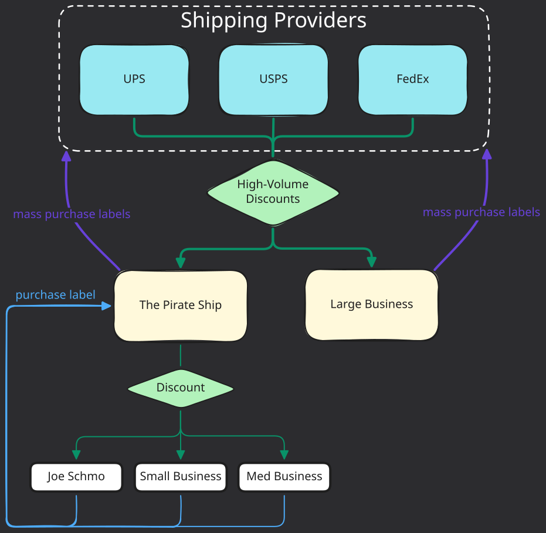
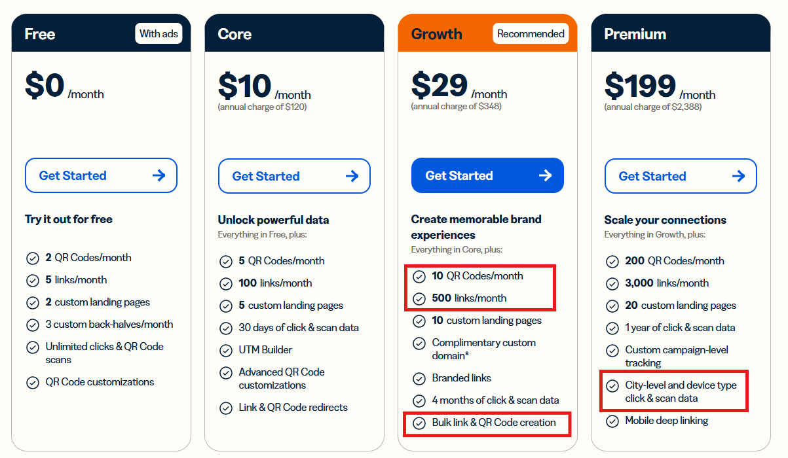

# Brainstorm
- [Brainstorm](#brainstorm)
  - [Middleman Ideas](#middleman-ideas)
    - [Intro: The Shipping Label Broker](#intro-the-shipping-label-broker)
    - [Exercise: Bitly](#exercise-bitly)

## Middleman Ideas

### Intro: The Shipping Label Broker

Plenty of businesses don't care to solve all inefficiency issues, which leaves plenty of opportunities for third-party business opportunities to fill in these inefficiency gaps with potential solutions.

Unknown to most of the general public, there exists something called label brokers. There are some inefficiencies with competitive pricing and shipping label creation/maintenance among large-scale shipping services like USPS, UPS and FedEx.

  

Small businesses and individuals looking to create shipping labels to ship out their items are sensitive to price and ease of use. 

> UPS, USPS and FedEx **do not care** about keeping track of 'What is the small-time shipping consumer willing to pay today that helps me stay competitive'? These are simply too small of fish to fry. The giant shipping providers care about maintaining symbiotic relationships with massive, large-volume businesses.

Label-brokers like [the Pirate Ship](https://www.pirateship.com/) will offer bulk label creation that is streamlined across **all shipping providers**. The customer doesn't need to care about handling label creation for UPS vs USPS; they can use whatever shipping provider is offering them the best pricing for the day, week, month, etc. The Pirate Ship also passes on discounts to their customers; this is done via becoming a large vendor and obtaining discounts from the shipping giants. 

How does the Pirate Ship get such a discount? All customer shipping labels get grouped under a single vendor name (The Pirate Ship). So to a shipping provider (UPS, FedEx, etc.) it looks like The Pirate Ship has the shipping volume of a large business. Huge businesses with consistent high volume of label purchasing can eventually obtain shipping provider discounts. The label broker then passes part of that savings back to customers. This requires up front money to take a loss for competitive label pricing to obtain customers until the label broker can achieve vendor discounts with shipping giants.

### Exercise: Bitly

This is more of a brainstorming thought exercise than anything serious around business creation. Here goes!

  

<em>Bitly pricing as of 3/22/2026</em>

Notes for the red boxes above:

- **# QR Codes**: As we see, Bitly offers very expensive QR Code creation. Even on their premium plan, you're only allowed to create 200 QR Codes a Month
  - This is likely due to the fact that Bitly is actually hosting a `bit.ly/[slug]` URL that redirects to wherever **you** want your URL to point to. So it's essentially not just 'creating a QR code'. It's also a hosting service.

- **# Links**: Bitly refers to "links" as shortened URLs - their bread and butter. Basically you get more `bit.ly/[slub]` creations with their metrics recording service.

- **City-level and device type click and scan data**: This is tracking the IP and device being used, similar to other metrics-recording hosting services. If someone is using a VPN, this could give inaccurate data. **"City-level" is a very honest statement**; you can't pinpoint where exactly in the city the activity happened, down to the street address, for instance.

- **Bulk link creation**: Seems to be `.csv` upload processing, similar to many such services handling bulk data inputs.

A couple things stick out to me here:

- More-specific geographic tracking unavailable.
  - This is more of a limit to do with the current digital space. Even companies like Apple struggle to help you visually/coordinate-ly (?) pinpoint where exactly you lost your iPhone, though they have such a feature (the ping sound for lost items works much better!). It's challenging to get accurate locations when it's a matter of just several feet/meters in distances + indoors.

- Cost seems a little high considering the # of links you get in return. 
  - These also don't track forever - the most premium plan only offers 1 year of click tracking data for 3200 links (200 QR, 3000 plain links).
  - I don't have enough knowledge to fairly evaluate their pricing model against their current volume of customers and hosting + maintenance costs.

