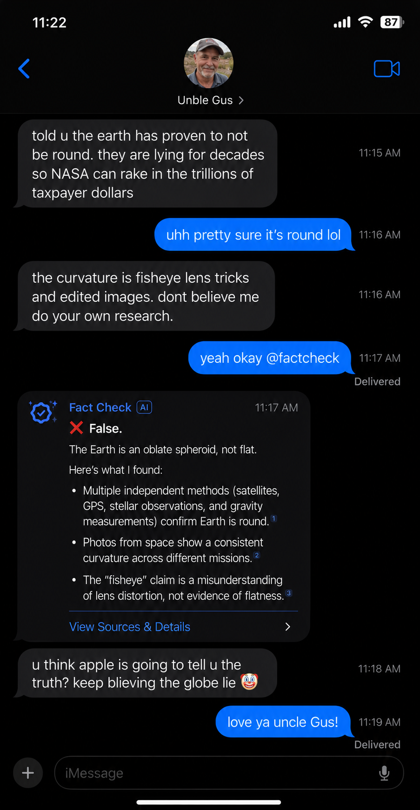
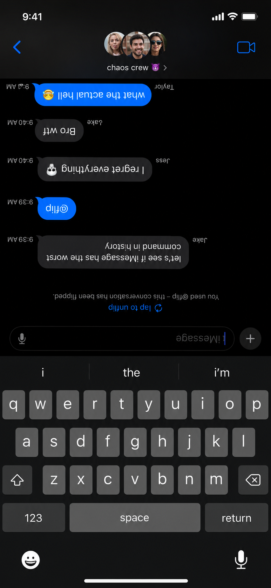
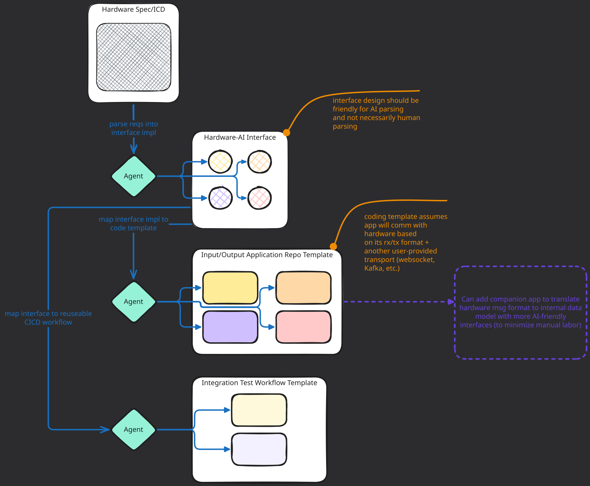

# Brainstorm

A collection of brainstorming ideas and projects.

## iMessage Commands

### @factcheck

Introducing the `@factcheck` command, exclusively for iMessage! Skip that Google search and have our built-in agent quickly factcheck recent information in your conversation, sources included.

### FAQ

> Is factchecker always right?

- Yes.

> What about my privacy?

- Digital privacy is an illusion, give up.

> I don't want this feature in my phone. Can I opt out?

- This feature will be included in all iMessage chats, as a security measure per our terms of service. If wanting to opt out, users can go to `Settings -> General -> Chats -> Privacy -> Messaging -> Privacy -> iMessage -> Force SMS` and set `Force SMS` to on. 

- Note that tech illiterate people may have trouble finding this setting. Therefore it will be on by default. Defaults are restored every phone reboot.

> What other commands will be available in the future?

- We are excited to add more commands in iMessage! While these are not confirmed to be future offerings, here are our current top contenders:

#### @emojifusion

`@emojifusion` is an energy-intensive command to do what users have always dreamed of: Fusing 2 emojis into 1 emoji. These are freshly generated with each command. Like a snowflake, each fusion will be unique!

#### @flip

`@flip` is for users who love a little lighthearted fun in their chats. This command will flip the chat messages for all users in the current chat to become upside down! **Note that the typing box will still remain right-side up.**

 `"I'll just reverse it by sending another @flip!"` you say? Not so fast there, cowboy! `@flip` has a 10 minute cooldown. Fun for the whole family, forever!

## Hardware <-> Software Implementation: Human Labor Reduction

In theory could be valuable if the framework were implemented well, even compared to giving a senior an AI tool to write a bunch of prompts and check over the outputs, building an app from scratch.

Some hardware would have additional features that would not be supported by the Hardware-AI Interface, but hopefully this sort of framework could

The testing framework likely has value on its own. Many non-UI apps are just data inputs and data outputs so can be abstracted & automated.

## Archives

- [QR Code Tracking](./archives/QR%20Code%20Tracking/README.md) - Brainstorm on QR code tracking systems for physical poster distribution and location-based engagement metrics.

